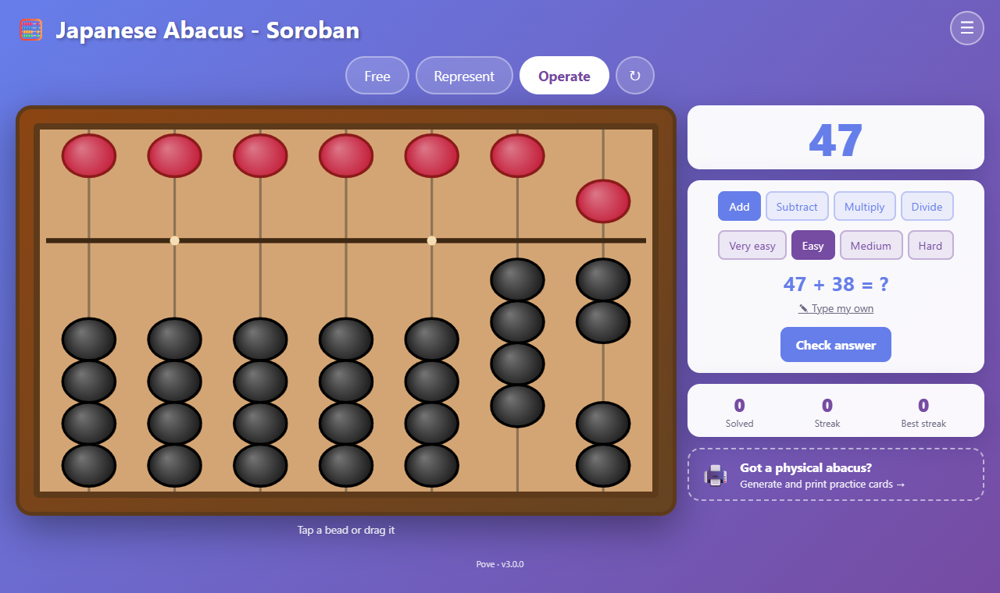
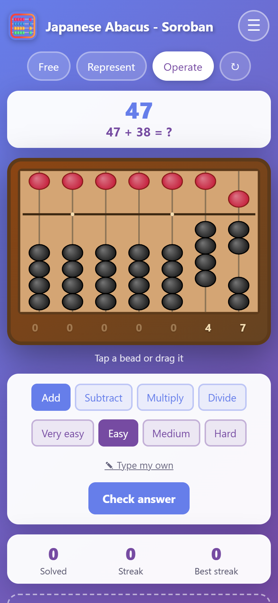

# 🧮 Soroban — Japanese abacus game and printable practice cards

An interactive **soroban** (Japanese abacus) for learning to read numbers and calculate with it, plus a
**card generator** that prints double-sided practice cards to play with a physical abacus.

- Runs in any modern browser on phones, tablets and computers — no installation, no account.
- Installable as an app (PWA) and fully usable **offline** after the first visit.
- Interface in **English and Spanish**; it starts in your browser's language and you can switch at any time.



## Features

### The game

| Mode          | What you do                                                                                                     |
| ------------- | --------------------------------------------------------------------------------------------------------------- |
| **Free**      | Play with the abacus; the number it shows is displayed above it.                                                |
| **Represent** | _Number → Abacus_: show the given number on the abacus. _Abacus → Number_: read the abacus and type the number. |
| **Operate**   | Solve additions, subtractions, multiplications and exact divisions by working them out on the abacus.           |

- **Four difficulty levels** for every mode. Addition and subtraction levels follow the real soroban
  techniques: easier levels avoid carries/borrows and avoid combining them with the "five rule" (see
  [`src/game/problems.js`](src/game/problems.js)).
- **Tap or drag** the beads. Tapping a bead moves it (and the ones between it and the beam), exactly like
  moving it with your finger on a real abacus. Beads are animated and the canvas is sharp on high-DPI screens.
- **Reading aid**: the digit of every rod is shown under the abacus (in Free and Operate modes), with leading
  zeros dimmed.
- **Keyboard**: Enter checks the answer and, once it is right, moves on to the next question.
- **Your own questions**: type any operation (`23+45`, `12x4`, `84/7` all work) or any number to represent.
- **Score**: solved questions, current streak and best streak (stored in your browser).
- **Two abacus styles** (classic wood/red/black and a simple yellow one) and **ten celebration effects**
  (from a tiny puff to dinosaurs, rainbows and "total madness"), plus "none" and a random surprise.
- **Layout for every screen**: on phones the question sits above the abacus so everything fits on one screen.



### The card generator

Open **Printable cards** in the header (or [`/cards/`](cards/index.html)).

- Generate a full deck in one click: _Add-Remove_, _Represent_, _Add_ and _Subtract_ cards at four difficulty levels, with
  the abacus drawn on the cards that need it.
- Or design your own cards (size, colors, text, abacus picture), edit many cards at once by type, select, clean
  duplicates, save/load projects as JSON.
- **A4 print preview** with 90 × 65 mm cards (8 per page), automatic or manual **double-sided printing**
  with correctly mirrored backs.

See the [card generator guide](docs/card-generator.md) for printing tips and the file formats.


## Quick start

Requires [Node.js](https://nodejs.org) 20 or newer.

```bash
npm install
npm run dev        # http://localhost:5173
```

| Script             | Purpose                                                                |
| ------------------ | ---------------------------------------------------------------------- |
| `npm run dev`      | Development server with hot reload                                     |
| `npm run build`    | Production build into `dist/`                                          |
| `npm run preview`  | Serve the production build locally                                     |
| `npm test`         | Unit tests (Vitest)                                                    |
| `npm run test:e2e` | End-to-end tests (Playwright; uses your installed Chrome, or CI's own) |
| `npm run lint`     | ESLint                                                                 |
| `npm run format`   | Prettier                                                               |
| `npm run test:all` | Lint + unit + e2e                                                      |

The first time you run the e2e tests on a machine without Chrome, run `npx playwright install chromium` and set
`CI=1`.

## Project layout

```
index.html            Game page            cards/index.html   Card generator page
src/
  core/               Pure building blocks: abacus model, random, storage, store
  game/               Game: state, actions, problems, abacus canvas, confetti, views
  cards/              Card generator: model, generator, print layout, SVG, UI
  i18n/               Translation engine and the English/Spanish dictionaries
  shared/             Header, toasts, service worker registration
  styles/             base.css (tokens and shared UI), game.css, cards.css
public/               Manifest, icons, service worker (copied as-is)
tests/unit/           Vitest unit tests        tests/e2e/   Playwright specs
docs/                 Architecture and card generator documentation
```

Read the [architecture notes](docs/architecture.md) for how the pieces fit together, and
[CONTRIBUTING.md](CONTRIBUTING.md) to add a language, a card type or a celebration effect.

## Testing

- **Unit tests** cover all logic that does not need a browser: the abacus model, problem generation rules,
  state migration, the card generator, pagination, SVG output, i18n (including a check that every key used in the
  code exists in both languages).
- **End-to-end tests** drive the real pages in Chrome: all three game modes, tapping and dragging beads, custom
  questions, language switching, scores, card generation, selection, editing, print pagination and file import/export.
- The e2e suite was first written against the original (pre-refactor) code and passed there unchanged, which is how
  the refactoring was proven not to change behavior. See [the architecture notes](docs/architecture.md#how-the-refactoring-was-verified).

## Deployment

Every push to `main` runs the checks and, if they pass, publishes the site to **GitHub Pages**
(see [`.github/workflows/ci.yml`](.github/workflows/ci.yml)). The build uses relative URLs, so it works unchanged on a
project site (`https://<user>.github.io/<repo>/`) or from any folder of a static web server.

## Privacy

Everything runs in your browser. The game stores its state (abacus position, settings, score) and your language
choice in `localStorage`; nothing is sent anywhere.

## Compatibility with earlier versions

Versions before 3.0 saved the game under the same `localStorage` key in a Spanish-keyed format. That format is
migrated automatically, so returning players keep their settings. Card projects (`.json`) and generation settings files
from the previous card generator still open — see the [guide](docs/card-generator.md#file-formats).

## License

[MIT](LICENSE)
