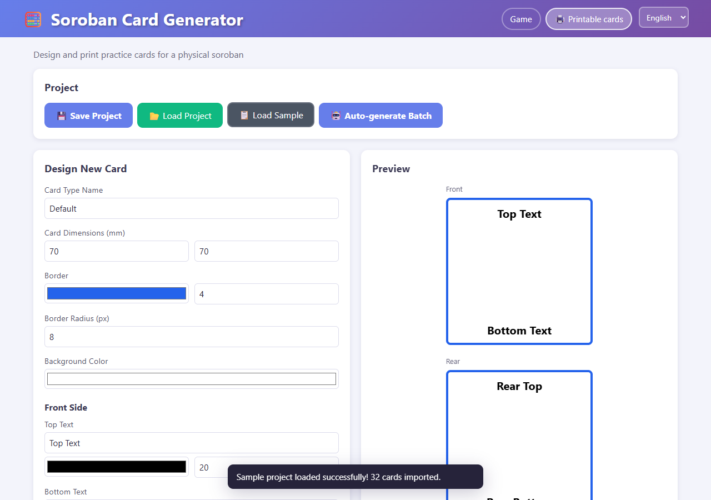
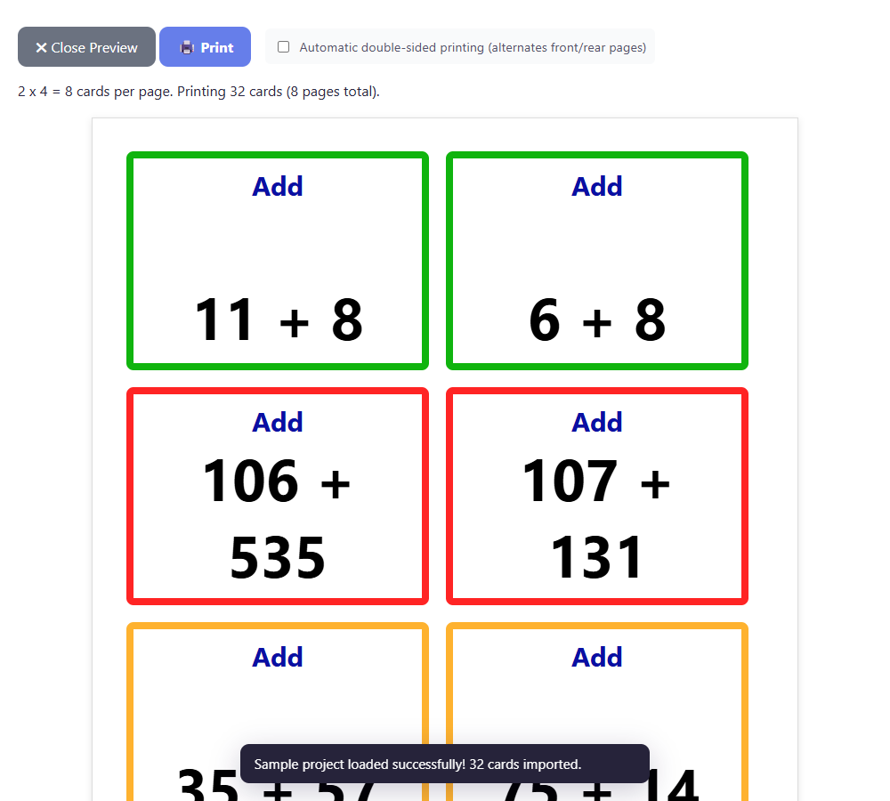

# Card generator guide

The card generator makes double-sided practice cards for a **physical soroban**. Open it from the **Printable cards**
link in the game header, or go to `/cards/`.



## Quick path: print a ready-made deck

1. Click **Auto-generate Batch**.
2. Choose how many cards per difficulty level and which card types you want, then **Generate Cards**.
3. Click **Print All** and, in the preview, choose how you will print (see below).
4. Cut the cards along the borders.

Prefer to look first? **Load Sample** fills the page with a small example deck.

## Card types

| Type           | Front                             | Back                                  |
| -------------- | --------------------------------- | ------------------------------------- |
| **Add-Remove** | "Add" `+ 249`                     | "Remove" `- 249`                      |
| **Represent**  | "Read" and a picture of an abacus | "Show" and the number as text         |
| **Add**        | "Add" `35 + 57`                   | the answer, and the abacus showing it |
| **Subtract**   | "Subtract" `94 - 64`              | the answer, and the abacus showing it |

The border colour tells the difficulty: <span style="color:#2bcdee">**very easy**</span> (light blue),
<span style="color:#10b40e">**easy**</span> (green), <span style="color:#feb22f">**medium**</span> (orange) and
<span style="color:#ff2424">**hard**</span> (red). Cards are 90 × 65 mm by default, which fits **8 per A4 page**.

Cards are generated without repeats inside a type and level, subtraction never goes negative, and the text printed on
the cards follows the language selected in the header when you generate them.

## Printing

Click **Print All** (or select some cards and click **Print Selected**) to open the print preview. It shows exactly
the A4 pages that will be printed and how many cards fit per page.



**Two ways to get fronts and backs on the same sheet:**

- **Printer with automatic double-sided printing** — tick _Automatic double-sided printing_. Pages alternate
  front, back, front, back… In your browser's print dialog choose **two-sided, flip on the long edge**.
- **Printer without it (manual)** — leave the box unticked. All fronts print first, then all backs. Print the fronts,
  put the sheets back in the tray (check which way your printer needs them) and print the backs.

The back pages are laid out right-to-left so that each back lands behind its own front once the sheet is flipped on the
long edge. Print one test sheet before printing a big deck, and check that fronts and backs line up.

**Print dialog settings** (Chrome/Edge/Firefox): paper **A4**, scale **100 %** (not "fit to page"), margins **none**
or default, and **Background graphics** enabled so borders and colours are printed.

Cards of different sizes are printed on separate pages, so you can mix sizes in one project.

## Designing your own cards

- Fill the form on the left: type name, size in millimetres, border and background, and for each side a top text, a
  bottom text (with colour and size) and optionally an **abacus picture** showing any number from 0 to 9 999 999.
- The preview on the right updates as you type. **Save New Card** adds it to the list.
- Click a card's ✏️ to edit it or 🗑️ to delete it. Click a card (or tick its checkbox) to select it.
- **Select by Type** selects every card of one or more types. **Edit by Type** (or **Edit Selected**) changes chosen
  properties on all of them at once — tick the property, set the value, apply. Only ticked properties change.
- **Clean Duplicates** removes cards that are identical in every property.

## File formats

Both are plain JSON and can be edited by hand.

### Project (`board-game-cards-YYYY-MM-DD.json`)

Saved by **Save Project**, loaded by **Load Project**.

```jsonc
{
  "version": 1,
  "savedDate": "2025-11-18T10:00:00.000Z",
  "cards": [
    {
      "cardType": "Add easy",
      "width": 90,
      "height": 65,
      "borderRadius": 8,
      "borderThickness": 8,
      "borderColor": "#10b40e",
      "backgroundColor": "#ffffff",
      "frontTopText": "Add",
      "frontTopColor": "#0a0fa3",
      "frontTopSize": 30,
      "frontBottomText": "11 + 8",
      "frontBottomColor": "#000000",
      "frontBottomSize": 65,
      "frontShowSVG": false,
      "frontSVGNumber": 0,
      "frontSVGSize": 0,
      "rearTopText": "Add - Answer",
      "rearTopColor": "#666666",
      "rearTopSize": 20,
      "rearBottomText": "19",
      "rearBottomColor": "#000000",
      "rearBottomSize": 30,
      "rearShowSVG": true,
      "rearSVGNumber": 19,
      "rearSVGSize": 130,
    },
  ],
}
```

Missing properties get sensible defaults and unknown properties are ignored. Projects saved by earlier versions open
unchanged.

### Generation settings

**Auto-generate Batch → Auto-generated Sample** downloads the default settings; edit them and bring them back with
**Load Custom Settings**.

```jsonc
{
  "version": 2,
  "numPerCombination": 10, // cards per type and level (the dialog overrides this)
  "maxGameValue": 9999999, // answers above this are skipped
  "cardTypes": ["addRemove", "represent", "add", "subtract"],
  "labels": {
    "types": { "addRemove": "Add-Remove" /* … */ },
    "levels": { "veryEasy": "very easy" /* … */ },
  },
  "difficulties": [{ "key": "veryEasy", "borderColor": "#2bcdee" } /* … */],
  "ranges": { "add": { "veryEasy": [1, 5], "easy": [1, 20] /* … */ } }, // operand range per type and level
  "baseTemplates": { "add": { "width": 90, "height": 65 /* … card look and fixed texts */ } },
}
```

- Remove a level from `difficulties` to skip it; change `ranges` to make cards easier or harder.
- Settings files from earlier versions (Spanish keys such as `"Añade-Quita"` and `"muy fácil"`) are converted when
  loaded, and the old names are kept as the card labels.
